# **LTI ATS** (Applicant Tracking System)


# Introducción

**LTI ATS** (Applicant Tracking System) es un **sistema de seguimiento de candidatos** que busca revolucionar el proceso de reclutamiento empresarial mediante **Inteligencia Artificial explicable**, **automatización avanzada** y **colaboración en tiempo real**.  

Su misión es crear el **ATS del futuro**, que combine eficiencia operativa, experiencia de usuario sobresaliente y un enfoque ético en el uso de la IA.


# Estado actual del mercado ATS

A continuación se presentan los principales competidores y sus características más destacadas.

### Principales plataformas analizadas

- **Lever**: Solución integral de reclutamiento con fuerte enfoque colaborativo y analítica avanzada.  
- **Greenhouse**: Reconocida por su enfoque en procesos de contratación estructurados y configurables.  
- **Zoho Recruit**: Accesible y flexible, con funcionalidades básicas de IA.  
- **Workable**: Popular por su facilidad de uso y automatización en la gestión de vacantes.

### Funcionalidades comunes

| Funcionalidad | Descripción |
|----------------|-------------|
| Publicación de vacantes | Distribución en portales y redes sociales |
| Seguimiento de candidatos | Pipeline visual con etapas de reclutamiento |
| Filtrado automático de CV | Uso de palabras clave o criterios configurables |
| Comunicación automatizada | Correos, recordatorios y notificaciones |
| Colaboración en equipo | Comentarios, asignaciones y visibilidad compartida |
| Analítica de reclutamiento | Dashboards con métricas básicas |
| Integraciones | Con calendarios, evaluaciones y HRIS |
| IA básica | Matching inicial y scoring simple |

### Limitaciones observadas

- Escasa **IA avanzada** o asistencia predictiva real.  
- Poca **colaboración en tiempo real** entre reclutadores y managers.  
- Automatizaciones **limitadas a correos o alertas simples**.  
- Experiencia del candidato poco cuidada o genérica.  
- Falta de **transparencia en decisiones de IA**.  
- Integraciones poco profundas con herramientas modernas (Slack, Teams, etc.).


### Matriz de Brechas de Funcionalidad

| Funcionalidad clave | Lever | Greenhouse | Zoho Recruit | Workable | Brecha para LTI |
|----------------------|:------:|:-----------:|:--------------:|:----------:|----------------|
| Eficiencia para RRHH | ✅ | ✅ | ⚠️ | ✅ | Automatización inteligente adaptativa |
| Colaboración en tiempo real | ✅ | ⚠️ | ⚠️ | ⚠️ | Chat y edición en contexto |
| Workflow configurable | ✅ | ✅ | ✅ | ✅ | Workflows con IA que aprenda |
| Asistencia de IA | ⚠️ | ⚠️ | ⚠️ | ⚠️ | IA explicable y predictiva |
| Sourcing / Talent pool | ⚠️ | ⚠️ | ⚠️ | ⚠️ | Nurturing continuo de candidatos pasivos |
| Integraciones modernas | ⚠️ | ✅ | ⚠️ | ✅ | Integración móvil y en tiempo real |
| Experiencia del candidato | ⚠️ | ⚠️ | ⚠️ | ⚠️ | Experiencia fluida y personalizada |
| Analítica avanzada | ⚠️ | ⚠️ | ⚠️ | ⚠️ | Analítica predictiva y benchmarking |
| IA transparente y ética | ❌ | ⚠️ | ❌ | ❌ | IA justa y auditable |
| Colaboración global | ⚠️ | ⚠️ | ❌ | ⚠️ | Gestión distribuida multi-zona |
| Automatización extendida | ⚠️ | ⚠️ | ⚠️ | ⚠️ | Incluye onboarding y firma electrónica |
| Matching inteligente | ⚠️ | ❌ | ❌ | ❌ | Recomendador proactivo de candidatos |


### Lean Canvas – Modelo de Negocio LTI ATS

| **Bloque** | **Descripción** |
|-------------|-----------------|
| **1. Problema** | Procesos de reclutamiento lentos, repetitivos y poco colaborativos. <br>Los ATS actuales carecen de IA explicable y personalización. <br>Los candidatos enfrentan falta de comunicación y seguimiento. |
| **2. Segmento de clientes** | - Empresas medianas y grandes con áreas de RRHH. <br>- Consultoras de reclutamiento. <br>- Startups en crecimiento con alta rotación. <br>- Universidades con programas de vinculación laboral. |
| **3. Propuesta de valor** | **“Reclutamiento inteligente, colaborativo y ético.”** <br>Un ATS que combina automatización avanzada, IA explicable y colaboración en tiempo real para ofrecer una experiencia eficiente y humana. |
| **4. Solución** | - Pipeline visual tipo Kanban. <br>- Asistente de IA que recomienda y predice. <br>- Colaboración en tiempo real. <br>- Portal de candidato interactivo. <br>- Analítica predictiva y dashboards inteligentes. |
| **5. Canales** | - Sitio web y demostraciones online. <br>- Marketing digital B2B (LinkedIn, webinars). <br>- Alianzas con consultoras y universidades. <br>- Programa de referidos. |
| **6. Métricas clave** | - Tiempo promedio de contratación. <br>- Adopción y retención de usuarios. <br>- Conversión de prueba a pago. <br>- NPS del candidato y reclutador. |
| **7. Ventaja competitiva** | - IA explicable y ética. <br>- Colaboración en tiempo real. <br>- Automatización extendida (onboarding). <br>- UX sobresaliente y API abierta. |
| **8. Estructura de costos** | - Desarrollo (backend, IA, UX). <br>- Infraestructura cloud. <br>- Marketing y ventas. <br>- Soporte técnico. <br>- Investigación en IA y experiencia de usuario. |
| **9. Fuentes de ingresos** | - Suscripciones SaaS mensuales/anuales. <br>- Planes escalables por usuarios o vacantes. <br>- Add-ons premium de IA avanzada. <br>- Servicios de implementación y capacitación. |
| **10. Early Adopters** | - Startups tecnológicas. <br>- Consultoras de talento humano. <br>- Empresas con alto volumen de contratación. |


Diagrama

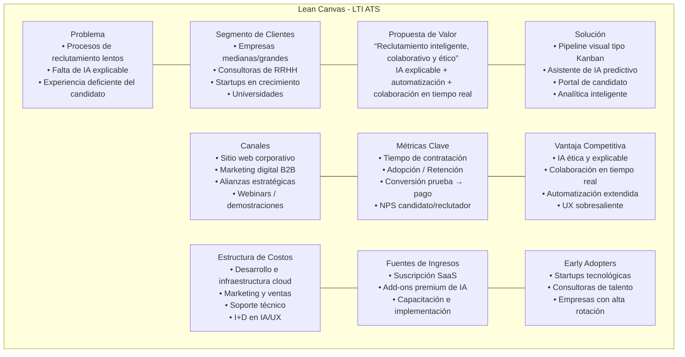


## Oportunidades y ventajas competitivas para LTI

### Innovaciones clave

1. **Asistente de IA conversacional**
   - Consultas en lenguaje natural y sugerencias proactivas.
   - Identificación de cuellos de botella.

2. **Matching inteligente**
   - Basado en éxito histórico de contrataciones.
   - Recomendación automática de candidatos pasivos.

3. **Colaboración en tiempo real**
   - Chat contextual, tableros compartidos, feedback móvil.

4. **Automatización extendida**
   - Workflows drag-and-drop con IA adaptativa.

5. **Analítica predictiva**
   - Predicción del “time-to-hire” y detección de sesgos.

6. **Experiencia del candidato premium**
   - Portal personalizado, chatbot y gamificación ligera.

7. **IA ética y explicable**
   - Transparencia sobre decisiones y auditoría de fairness.


### Propuesta de Roadmap para LTI

| Fase | Enfoque | Características principales |
|------|----------|------------------------------|
| **MVP** | Base sólida | Pipeline visual, automatización básica, dashboard inicial |
| **Fase 2** | Diferenciación | IA de scoring, colaboración móvil, workflows configurables |
| **Fase 3** | Innovación | Analítica predictiva, IA explicable, marketplace de integraciones |

---


# Diseño del Producto – LTI ATS

### 🎯 Objetivo
Traducir la propuesta de valor del sistema **LTI ATS** en funcionalidades claras y medibles, estableciendo los **requisitos funcionales**, **casos de uso** y **user stories** que servirán de base para el desarrollo del MVP.


### 1. Funcionalidades principales del sistema

| Categoría | Funcionalidades clave | Prioridad |
|------------|----------------------|------------|
| **Gestión de Vacantes** | Crear, publicar, editar y cerrar vacantes; vincular con portales de empleo. | Alta |
| **Gestión de Candidatos** | Pipeline tipo Kanban, búsqueda y filtrado, asignación a reclutadores. | Alta |
| **Automatización Inteligente** | Reglas automáticas para correos, recordatorios y flujos de onboarding. | Alta |
| **Colaboración en Tiempo Real** | Chat interno, comentarios en perfiles, integración con Slack/Teams. | Media |
| **Asistente de IA** | Recomendación de candidatos y predicción de contratación. | Media |
| **Analítica y Reportes** | Dashboards con métricas y analítica predictiva. | Media |
| **Portal del Candidato** | Seguimiento del proceso, chat, notificaciones automáticas. | Media |
| **Seguridad y Cumplimiento** | Control de accesos, consentimiento de datos, auditoría. | Alta |


### 2.a. Requisitos funcionales (RF)

#### UC01 – Publicar Vacante
1. **RF01.** El sistema permitirá crear una nueva vacante con campos obligatorios: título, descripción, ubicación, salario, tipo de contrato y nivel de experiencia.  
2. **RF02.** El sistema validará los datos ingresados antes de almacenar la vacante.  
3. **RF03.** El sistema permitirá guardar la vacante como borrador antes de su publicación.  
4. **RF04.** El sistema publicará la vacante en el portal del candidato y la marcará como activa.  
5. **RF05.** El sistema registrará automáticamente la fecha y usuario responsable de la publicación.  
6. **RF06.** El sistema permitirá desactivar o archivar una vacante publicada.  


#### UC02 – Gestionar Candidatos y Pipeline
7. **RF07.** El sistema permitirá visualizar los candidatos postulados a cada vacante.  
8. **RF08.** El reclutador podrá mover candidatos entre etapas del pipeline (Nuevo, Entrevista, Oferta, Contratado, Rechazado).  
9. **RF09.** El sistema registrará automáticamente el cambio de etapa y usuario responsable.  
10. **RF10.** El sistema permitirá filtrar y buscar candidatos por nombre, habilidades o estado.  
11. **RF11.** El sistema almacenará los comentarios y evaluaciones de entrevistas asociados al candidato.  
12. **RF12.** El sistema generará notificaciones internas cuando un candidato cambie de etapa.  


#### UC03 – Asistente de IA (Recomendador)
13. **RF13.** El sistema permitirá activar el asistente de IA desde la interfaz del reclutador.  
14. **RF14.** El asistente de IA analizará el perfil del candidato y la descripción de la vacante para calcular una puntuación de compatibilidad.  
15. **RF15.** El sistema mostrará una lista priorizada de candidatos sugeridos por IA.  
16. **RF16.** El sistema almacenará las recomendaciones generadas y su justificación explicable (atributos más relevantes).  
17. **RF17.** El usuario podrá aceptar o descartar sugerencias de la IA y registrar su decisión.  


#### UC04 – Portal del Candidato
18. **RF18.** El candidato podrá crear una cuenta mediante correo electrónico o inicio de sesión social.  
19. **RF19.** El candidato podrá cargar su CV y completar su perfil con información profesional y de contacto.  
20. **RF20.** El candidato podrá postularse a vacantes activas.  
21. **RF21.** El sistema permitirá al candidato consultar el estado de su postulación.  
22. **RF22.** El sistema notificará por correo o panel al candidato cuando su estado cambie.  
23. **RF23.** El sistema permitirá al candidato eliminar o actualizar su perfil.  


#### UC05 – Analítica y Reportes (Futuro)
24. **RF24.** El sistema generará métricas de desempeño por vacante, reclutador y canal de origen.  
25. **RF25.** El sistema permitirá visualizar dashboards interactivos con filtros por periodo y área.  
26. **RF26.** El sistema exportará reportes en formato CSV y PDF.  
27. **RF27.** El sistema calculará automáticamente tiempos promedio por etapa del pipeline.  
28. **RF28.** El sistema permitirá configurar alertas cuando los tiempos excedan umbrales definidos.  


#### UC06 – Automatización Inteligente (Futuro)
29. **RF29.** El sistema permitirá definir reglas automáticas de flujo (ej. enviar correo al pasar a Entrevista).  
30. **RF30.** El sistema permitirá activar o desactivar reglas sin eliminar su configuración.  
31. **RF31.** El sistema ejecutará acciones automáticas según condiciones predefinidas.  
32. **RF32.** El sistema registrará cada ejecución de regla en el historial del sistema.  
33. **RF33.** El usuario podrá crear nuevas plantillas de mensajes asociadas a las reglas.  


### 2.b. Requisitos No Funcionales (RNF)

1. **RNF01.** El sistema deberá estar disponible el 99.5% del tiempo mensual.  
2. **RNF02.** La respuesta del sistema no deberá superar los 2 segundos en operaciones críticas.  
3. **RNF03.** Toda comunicación entre cliente y servidor deberá estar cifrada (HTTPS/TLS 1.3).  
4. **RNF04.** El sistema deberá cumplir con políticas de protección de datos personales (GDPR y LFPDPPP).  
5. **RNF05.** La arquitectura deberá soportar escalabilidad horizontal mediante contenedores.  
6. **RNF06.** El sistema deberá registrar logs centralizados con trazabilidad por usuario y transacción.  
7. **RNF07.** El sistema deberá ofrecer autenticación basada en OAuth 2.0 y JWT.  
8. **RNF08.** El sistema deberá mantener compatibilidad con navegadores modernos y dispositivos móviles.  
9. **RNF09.** Las operaciones críticas deberán tener confirmación del usuario antes de su ejecución.  
10. **RNF10.** El sistema deberá contar con respaldo automático diario y retención mínima de 30 días.  


### 3. Casos de uso principales

El sistema se compone de **tres actores principales** y **seis casos de uso base**, además de varios procesos automáticos incluidos o extendidos.

---

#### 👥 Actores principales

**1. Reclutador**:  
- Publica vacantes.  
- Gestiona el pipeline de candidatos.  
- Utiliza las herramientas de IA para filtrar, puntuar y recomendar perfiles.  
- Consulta reportes analíticos sobre las métricas de contratación.  

**2. Manager**:   
- Revisa y aprueba candidatos sugeridos por el reclutador o el sistema.  
- Participa en la toma de decisiones mediante reportes y analítica.  

**3. Candidato**:   
- Accede al **Portal del Candidato** para consultar el estado de su proceso.  
- Recibe notificaciones y recordatorios automáticos.  


#### ⚙️ Casos de uso principales

| Código | Nombre del caso de uso | Descripción general |
|:------:|-------------------------|----------------------|
| **UC01** | Publicar Vacante | Permite al reclutador crear y difundir vacantes en la plataforma, vinculándolas con fuentes externas si es necesario. |
| **UC02** | Gestionar Candidatos | Centraliza la información de los postulantes, su avance y comunicación en el pipeline. |
| **UC03** | Asistente de IA | Brinda apoyo inteligente para filtrar, priorizar y recomendar candidatos según su afinidad con las vacantes. |
| **UC04** | Analítica y Reportes | Proporciona métricas sobre eficiencia, tiempo de contratación, fuentes de talento y desempeño del equipo. |
| **UC05** | Automatización Inteligente | Configura flujos automáticos como correos, recordatorios y cambios de estado. |
| **UC06** | Portal del Candidato | Interfaz dedicada a los postulantes para revisar su progreso y recibir notificaciones. |


#### 🔄 Casos de uso extendidos o incluidos

- **Calcular afinidad candidato-vacante** → Incluido dentro del Asistente de IA (UC03) y Automatización Inteligente (UC05).  
- **Enviar correos automáticos** → Extiende la funcionalidad de Automatización Inteligente y Portal del Candidato.  
- **Notificar cambios de estado** → Actividad automática al actualizar el pipeline de un candidato.  
- **Recibir recordatorios** → Se activa por reglas configuradas en el motor de automatización.

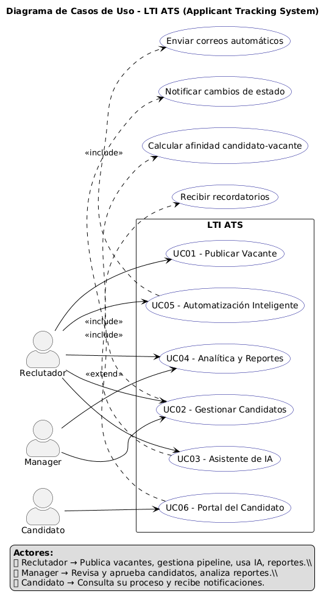

### UC01 – Publicar una vacante

#### 1. Descripción general

El caso de uso **UC01 – Publicar una Vacante** permite al **reclutador** crear una nueva oferta de empleo dentro del sistema **LTI ATS** y publicarla automáticamente en diferentes portales externos.  
Representa el punto de inicio del flujo de reclutamiento y es una de las funcionalidades más utilizadas del sistema.


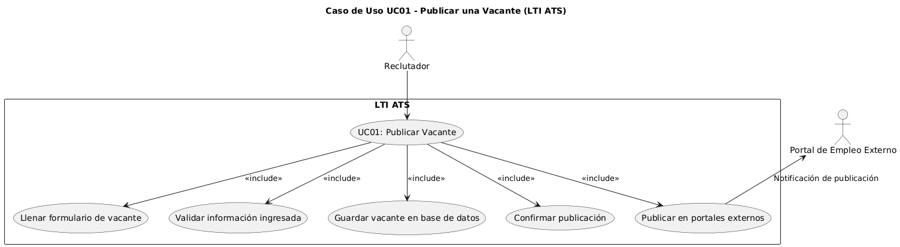

#### 2. Información básica

| Elemento | Descripción |
|-----------|-------------|
| **Identificador:** | UC01 |
| **Nombre:** | Publicar una Vacante |
| **Actor principal:** | Reclutador |
| **Actores secundarios:** | Portal de empleo externo, Base de datos |
| **Propósito:** | Permitir al reclutador crear, registrar y publicar vacantes en diversos portales de empleo desde una sola interfaz. |
| **Precondiciones:** | El reclutador debe haber iniciado sesión correctamente en el sistema. |
| **Postcondiciones:** | La vacante queda registrada en la base de datos y publicada externamente con confirmación. |
| **Frecuencia de uso:** | Alta |
| **Prioridad:** | Alta |


#### 3. Flujo principal

1. El reclutador selecciona la opción **“Crear nueva vacante”**.  
2. El sistema muestra el formulario para ingresar los datos del puesto.  
3. El reclutador introduce la información: puesto, descripción, requisitos, ubicación, salario, modalidad, etc.  
4. El reclutador selecciona los portales externos donde desea publicar (LinkedIn, OCC, Indeed, etc.).  
5. El sistema valida la información ingresada.  
6. El sistema guarda la vacante en la base de datos.  
7. El sistema publica automáticamente la vacante en los portales seleccionados.  
8. El sistema muestra un mensaje de confirmación con los enlaces a las publicaciones.  


#### 4. Flujos alternos

| ID | Condición | Descripción |
|----|------------|-------------|
| **A1** | Información incompleta | Si faltan campos obligatorios, el sistema muestra un mensaje de error y solicita corrección. |
| **A2** | Error de conexión con portal externo | El sistema guarda la vacante internamente y notifica que la publicación externa no se completó. |
| **A3** | Sesión expirada | Si el usuario pierde la sesión, se redirige al inicio de sesión antes de continuar. |


#### 5. Requisitos asociados

| ID | Descripción |
|----|--------------|
| RF01 | El sistema permitirá crear una nueva vacante con campos obligatorios: título, descripción, ubicación, salario, tipo de contrato y nivel de experiencia. |
| RF02 | El sistema validará los datos ingresados antes de almacenar la vacante. |
| RF03 | El sistema permitirá guardar la vacante como borrador antes de su publicación. |
| RF04 | El sistema publicará la vacante en el portal del candidato y la marcará como activa. |
| RF05 | El sistema registrará automáticamente la fecha y usuario responsable de la publicación. |
| RF06 | El sistema permitirá desactivar o archivar una vacante publicada. |


#### 6. Actores involucrados


- **Reclutador:** Usuario principal que crea y publica la vacante.  
- **Portal de empleo externo:** Sistema con el que LTI ATS se comunica mediante API o integración.  
- **Base de datos:** Repositorio donde se almacena la información de la vacante.


#### 7. Diagrama de Caso de Uso (PlantUML)

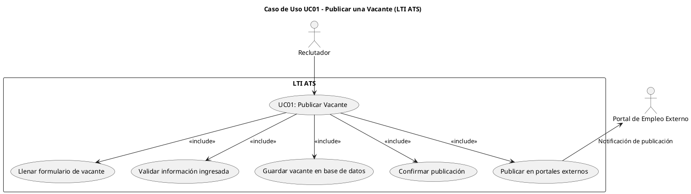

#### 8. Observaciones

- Este caso de uso constituye un flujo **crítico** dentro del MVP del sistema.  
- Su correcto funcionamiento garantiza la visibilidad y el inicio del proceso de reclutamiento.  
- En fases futuras, se podrá ampliar con **automatizaciones** (recordatorios o expiración automática de vacantes).  


### Caso de Uso UC02 – Gestionar Candidatos en Pipeline

#### 1. Descripción general

El caso de uso **UC02 – Gestionar Candidatos en Pipeline** describe cómo el **reclutador** y el **manager** visualizan, organizan y actualizan el estado de los candidatos dentro del flujo de reclutamiento.  
Este caso representa la funcionalidad principal del sistema **LTI ATS**, centrada en la gestión colaborativa del proceso de selección.

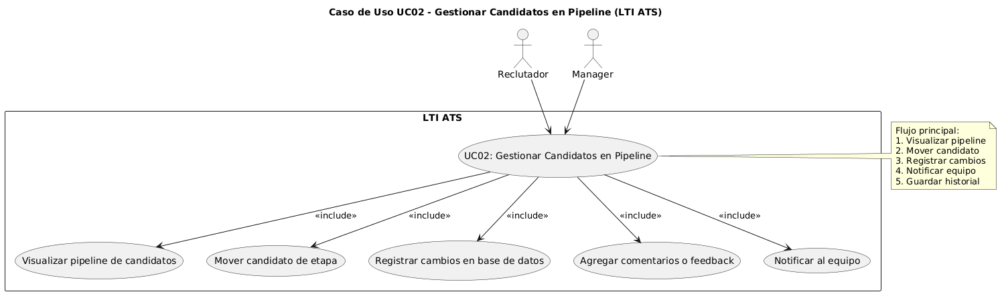

#### 2. Información básica

| Elemento | Descripción |
|-----------|-------------|
| **Identificador:** | UC02 |
| **Nombre:** | Gestionar Candidatos en Pipeline |
| **Actores principales:** | Reclutador, Manager |
| **Actor secundario:** | Base de datos |
| **Propósito:** | Permitir mover, clasificar y actualizar candidatos dentro del pipeline de reclutamiento, facilitando la colaboración y visibilidad del proceso. |
| **Precondiciones:** | Debe existir al menos una vacante activa y candidatos asociados. |
| **Postcondiciones:** | El sistema actualiza la información del candidato en la base de datos y notifica a los actores correspondientes. |
| **Frecuencia de uso:** | Muy alta |
| **Prioridad:** | Alta |


#### 3. Flujo principal

1. El reclutador o manager accede al módulo **“Pipeline de candidatos”**.  
2. El sistema muestra las etapas del proceso (Ej. Aplicación → Revisión → Entrevista → Oferta → Contratado).  
3. El usuario visualiza la lista de candidatos en cada etapa.  
4. El usuario **arrastra** (drag & drop) un candidato a una nueva etapa.  
5. El sistema actualiza el estado del candidato y registra la fecha y responsable del cambio.  
6. El sistema envía una **notificación** al equipo correspondiente.  
7. El manager puede agregar **comentarios o feedback** sobre el candidato.  
8. El sistema almacena el historial de interacciones para referencia futura.


#### 4. Flujos alternos

| ID | Condición | Descripción |
|----|------------|-------------|
| **A1** | Candidato no válido | Si el candidato fue eliminado o descalificado, el sistema muestra advertencia y evita cambios. |
| **A2** | Fallo de conexión | Si ocurre un error de red, el sistema guarda los cambios localmente y los sincroniza al restablecer conexión. |
| **A3** | Falta de permisos | Si el usuario no tiene permisos, se muestra mensaje de acceso denegado. |


#### 5. Requisitos asociados

| ID | Descripción |
|----|--------------|
| RF07 | El sistema permitirá visualizar los candidatos postulados a cada vacante. |
| RF08 | El reclutador podrá mover candidatos entre etapas del pipeline (Nuevo, Entrevista, Oferta, Contratado, Rechazado). |
| RF09 | El sistema registrará automáticamente el cambio de etapa y usuario responsable. |
| RF10 | El sistema permitirá filtrar y buscar candidatos por nombre, habilidades o estado. |
| RF11 | El sistema almacenará los comentarios y evaluaciones de entrevistas asociados al candidato. |
| RF12 | El sistema generará notificaciones internas cuando un candidato cambie de etapa. |


#### 6. Actores involucrados

- **Reclutador:** Administra el pipeline, mueve candidatos y agrega comentarios.  
- **Manager:** Supervisa el pipeline y aporta feedback sobre los candidatos.  
- **Base de datos:** Registra los cambios y mantiene el historial de estado.


#### 7. Diagrama de Caso de Uso (PlantUML)

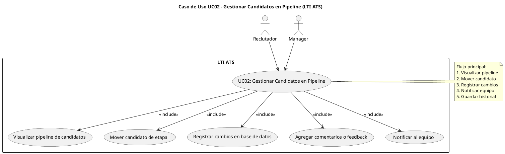


### Caso de Uso UC03 – Asistente de IA (Recomendador)

#### 1. Descripción general

El caso de uso **UC03 – Asistente de IA (Recomendador)** permite al **reclutador** utilizar un motor de inteligencia artificial para **sugerir candidatos óptimos** a una vacante, **analizar su afinidad** con el perfil y **explicar las razones** detrás de la recomendación.  

Este caso de uso aporta una **ventaja competitiva clave** para LTI ATS, ya que optimiza el tiempo de búsqueda y mejora la calidad de las contrataciones mediante **IA explicable, ética y transparente**.

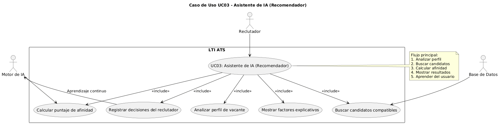

#### 2. Información básica

| Elemento | Descripción |
|-----------|-------------|
| **Identificador:** | UC03 |
| **Nombre:** | Asistente de IA (Recomendador) |
| **Actor principal:** | Reclutador |
| **Actores secundarios:** | Motor de IA, Base de datos |
| **Propósito:** | Sugerir los mejores candidatos para una vacante activa, explicando las razones de la recomendación. |
| **Precondiciones:** | Debe existir al menos una vacante activa y candidatos registrados en el sistema. |
| **Postcondiciones:** | El sistema muestra un listado de candidatos sugeridos con sus puntajes y explicaciones. |
| **Frecuencia de uso:** | Media |
| **Prioridad:** | Alta |


#### 3. Flujo principal

1. El reclutador abre una vacante activa dentro del sistema.  
2. El sistema ejecuta el **motor de IA** y analiza el perfil de la vacante.  
3. La IA busca candidatos en la base de datos y calcula un **puntaje de afinidad**.  
4. El sistema muestra una lista de **candidatos sugeridos**, ordenados por compatibilidad.  
5. El reclutador puede hacer clic en cada candidato para ver los **factores que influyeron en el puntaje** (ej. habilidades, experiencia, idioma, ubicación).  
6. El reclutador puede **aceptar, guardar o descartar** las recomendaciones.  
7. El sistema registra las decisiones para mejorar las sugerencias futuras (aprendizaje continuo).  


#### 4. Flujos alternos

| ID | Condición | Descripción |
|----|------------|-------------|
| **A1** | No hay suficientes datos | El sistema notifica al usuario y sugiere cargar más información de candidatos o vacantes. |
| **A2** | Error del motor de IA | El sistema muestra mensaje de error y permite realizar búsqueda manual. |
| **A3** | Vacante sin requisitos definidos | El sistema solicita completar los campos antes de ejecutar el análisis. |


#### 5. Requisitos asociados

#### 5. Requisitos asociados

| ID | Descripción |
|----|--------------|
| RF13 | El sistema permitirá activar el asistente de IA desde la interfaz del reclutador. |
| RF14 | El asistente de IA analizará el perfil del candidato y la descripción de la vacante para calcular una puntuación de compatibilidad. |
| RF15 | El sistema mostrará una lista priorizada de candidatos sugeridos por IA. |
| RF16 | El sistema almacenará las recomendaciones generadas y su justificación explicable (atributos más relevantes). |
| RF17 | El usuario podrá aceptar o descartar sugerencias de la IA y registrar su decisión. |


#### 6. Actores involucrados

- **Reclutador:** Usuario principal que utiliza el asistente de IA para encontrar candidatos.  
- **Motor de IA:** Componente del sistema que analiza datos y genera recomendaciones.  
- **Base de datos:** Contiene información de vacantes, perfiles y resultados históricos.


#### 7. Diagrama de Caso de Uso (PlantUML)

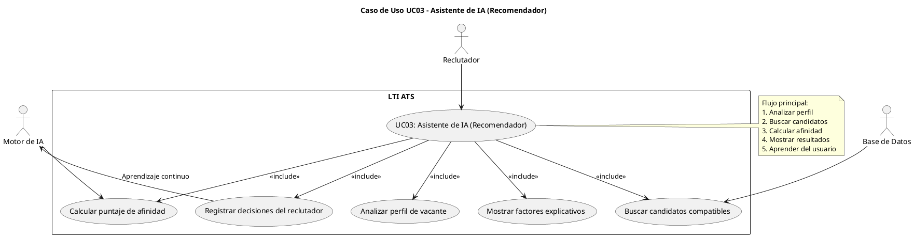

#### 8. Observaciones

- Este caso de uso refleja el **componente innovador** del sistema LTI ATS.
- Permite **automatizar decisiones** sin perder transparencia ni control humano.
- Los resultados se retroalimentan para mejorar la precisión del motor de IA.
- La trazabilidad de decisiones es esencial para garantizar **ética y cumplimiento normativo** (IA explicable).

---

### 💼 Caso de Uso UC04 – Portal del Candidato

#### 1. Descripción general

El caso de uso **UC04 – Portal del Candidato** permite al **candidato** consultar el estado de sus postulaciones, recibir actualizaciones, y comunicarse con el reclutador a través de una interfaz amigable e intuitiva.  

Este módulo busca **mejorar la experiencia del candidato**, aumentar la transparencia del proceso y fortalecer la imagen de la empresa contratante.

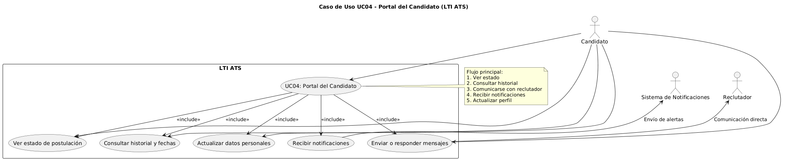

#### 2. Información básica

| Elemento | Descripción |
|-----------|-------------|
| **Identificador:** | UC04 |
| **Nombre:** | Portal del Candidato |
| **Actor principal:** | Candidato |
| **Actores secundarios:** | Reclutador, Sistema de notificaciones |
| **Propósito:** | Permitir al candidato consultar el estado de su proceso de reclutamiento, recibir notificaciones y comunicarse con el reclutador. |
| **Precondiciones:** | El candidato debe haber enviado su solicitud o haber sido invitado a participar en una vacante. |
| **Postcondiciones:** | El sistema actualiza el historial de actividad y registra las interacciones del candidato. |
| **Frecuencia de uso:** | Alta |
| **Prioridad:** | Alta |


#### 3. Flujo principal

1. El candidato accede al **Portal del Candidato** mediante enlace o credenciales.  
2. El sistema muestra una vista general de sus postulaciones activas.  
3. El candidato selecciona una vacante para ver su estado (Ej. En revisión, Entrevista, Oferta).  
4. El sistema despliega el historial de acciones y fechas asociadas.  
5. El candidato puede **enviar mensajes o responder** a comunicaciones del reclutador.  
6. El sistema envía **notificaciones automáticas** por correo o dentro del portal (Ej. confirmación de entrevista).  
7. El candidato puede actualizar algunos datos personales o subir documentos adicionales (CV actualizado, portafolio).  
8. El sistema registra toda la actividad para referencia del reclutador y auditoría.


#### 4. Flujos alternos

| ID | Condición | Descripción |
|----|------------|-------------|
| **A1** | Usuario no autenticado | El sistema solicita iniciar sesión antes de mostrar el portal. |
| **A2** | Postulación inexistente | Si el candidato intenta acceder a una vacante no válida, se muestra mensaje de error. |
| **A3** | Fallo en el envío de mensaje | El sistema guarda el mensaje en cola y lo reenvía cuando se restablezca la conexión. |


#### 5. Requisitos asociados

| ID | Descripción |
|----|--------------|
| RF18 | El candidato podrá crear una cuenta mediante correo electrónico o inicio de sesión social. |
| RF19 | El candidato podrá cargar su CV y completar su perfil con información profesional y de contacto. |
| RF20 | El candidato podrá postularse a vacantes activas. |
| RF21 | El sistema permitirá al candidato consultar el estado de su postulación. |
| RF22 | El sistema notificará por correo o panel al candidato cuando su estado cambie. |
| RF23 | El sistema permitirá al candidato eliminar o actualizar su perfil. |


#### 6. Actores involucrados

- **Candidato:** Usuario principal que consulta su proceso y se comunica con el reclutador.  
- **Reclutador:** Actor secundario que recibe mensajes y actualiza el estado de la postulación.  
- **Sistema de notificaciones:** Envia correos y alertas automáticas sobre cambios en el proceso.


#### 7. Diagrama de Caso de Uso (PlantUML)

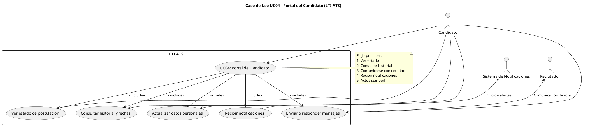


### 4. User Stories (Historias de usuario)

| ID | Historia de Usuario | Criterio de aceptación |
|----|---------------------|-------------------------|
| HU01 | Como **reclutador**, quiero **crear y publicar una vacante** para recibir postulaciones más rápido. | La vacante aparece publicada en los portales seleccionados. |
| HU02 | Como **reclutador**, quiero **ver a los candidatos en un pipeline visual** para gestionar su avance fácilmente. | Puedo mover candidatos y el sistema actualiza automáticamente su etapa. |
| HU03 | Como **manager**, quiero **dar feedback sobre candidatos** desde el mismo sistema. | El feedback se guarda y notifica al reclutador. |
| HU04 | Como **reclutador**, quiero que **el sistema recomiende candidatos con IA**. | El sistema muestra una lista con puntajes y explicación de afinidad. |
| HU05 | Como **candidato**, quiero **saber en qué etapa está mi postulación**. | El portal muestra estado actualizado y mensajes del reclutador. |
| HU06 | Como **empresa**, quiero **cumplir con la ley de protección de datos**. | Se registra el consentimiento de los candidatos y los accesos se auditan. |


**Tabla de trazabilidad** entre funcionalidades, requisitos, casos de uso y user stories del sistema LTI ATS:

| Funcionalidad              | Requisitos (RF)                     | Casos de Uso (UC)                      | User Stories (HU)                                                                                            |
|:---------------------------|:------------------------------------|:---------------------------------------|:-------------------------------------------------------------------------------------------------------------|
| Gestión de Vacantes        | RF01: Crear vacantes                | UC01: Publicar una vacante             | HU01: Como reclutador quiero crear y publicar una vacante para recibir postulaciones más rápido.             |
|                            | RF02: Publicar en portales          |                                        |                                                                                                              |
| Gestión de Candidatos      | RF03: Pipeline visual               | UC02: Gestionar candidatos en pipeline | HU02: Como reclutador quiero ver a los candidatos en un pipeline visual para gestionar su avance fácilmente. |
|                            | RF04: Comentarios y feedback        |                                        |                                                                                                              |
| Asistente de IA            | RF06: Mostrar factores del match    | UC03: Asistente de IA (recomendador)   | HU04: Como reclutador quiero que el sistema recomiende candidatos con IA.                                    |
| Portal del Candidato       | RF08: Seguimiento de postulación    | UC04: Portal del candidato             | HU05: Como candidato quiero saber en qué etapa está mi postulación.                                          |
| Automatización Inteligente | RF05: Configurar reglas automáticas | UC06: Automatización inteligente       | HU07: Como reclutador quiero que se envíen recordatorios automáticos a los candidatos inactivos.             |
| Analítica y Reportes       | RF07: Dashboard de métricas         | UC05: Analítica y reportes             | HU08: Como manager quiero ver estadísticas del proceso de contratación para mejorar los tiempos.             |


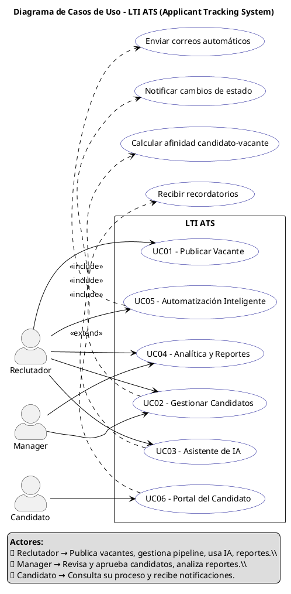

### 5. Criterios de éxito del MVP

- Tiempo promedio de publicación de vacante < **5 minutos**.  
- Reducción del **30% en tareas manuales** de comunicación o seguimiento.  
- Implementación del **pipeline colaborativo funcional** (drag & drop).  
- Integración con al menos **2 portales de empleo externos**.  
- Disponibilidad del **asistente de IA básico** (sugerencias iniciales).  
- Portal de candidato operativo con notificaciones automáticas.


---

# 🧱 Modelo de Datos Completo – LTI ATS (Applicant Tracking System)

Se describe el **modelo de datos completo** del sistema **LTI ATS**, incluyendo todas las entidades principales, sus campos más relevantes y las relaciones entre ellas.  
El diseño sigue principios de **normalización (3NF)**, **modularidad** y **escalabilidad**, alineados con los casos de uso UC01–UC04 y las necesidades de IA, analítica, automatización y colaboración.


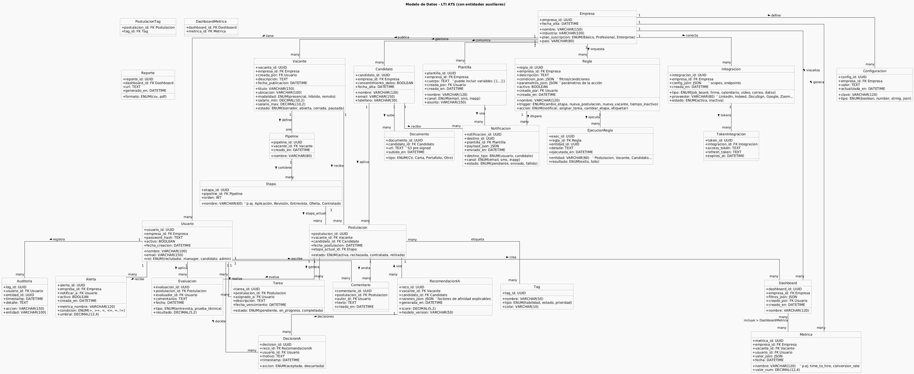

## 🧩 1. Entidades Principales

### 🧍 Usuario/Reclutador
Representa a toda persona que interactúa con el sistema.

| Campo | Tipo | Descripción |
|--------|------|--------------|
| `usuario_id` | UUID | Identificador único. |
| `nombre` | VARCHAR(100) | Nombre completo. |
| `email` | VARCHAR(150) | Correo electrónico único. |
| `rol` | ENUM('reclutador','manager','candidato','admin') | Tipo de usuario. |
| `password_hash` | TEXT | Contraseña cifrada. |
| `activo` | BOOLEAN | Estado de la cuenta. |
| `fecha_creacion` | DATETIME | Fecha de registro. |

Relaciones: 1:N con Vacante, Candidato, Comentario, Notificación, Tarea, Evaluación.


### 💼 Vacante

| Campo | Tipo | Descripción |
|--------|------|--------------|
| `vacante_id` | UUID | Identificador único. |
| `titulo` | VARCHAR(150) | Nombre del puesto. |
| `descripcion` | TEXT | Detalle del puesto. |
| `salario_min`, `salario_max` | DECIMAL(10,2) | Rango salarial. |
| `ubicacion` | VARCHAR(100) | Lugar de trabajo. |
| `modalidad` | ENUM('presencial','híbrido','remoto') | Tipo de trabajo. |
| `estado` | ENUM('abierta','cerrada','pausada') | Estado actual. |
| `creada_por` | FK → Usuario | Reclutador responsable. |
| `empresa_id` | FK → Empresa | Empresa que publica. |

Relaciones: 1:N con Postulación, Pipeline, Recomendación_IA, Tarea.


### 👤 Candidato

| Campo | Tipo | Descripción |
|--------|------|--------------|
| `candidato_id` | UUID | Identificador único. |
| `nombre` | VARCHAR(120) | Nombre completo. |
| `email` | VARCHAR(150) | Correo electrónico. |
| `telefono` | VARCHAR(20) | Teléfono de contacto. |
| `ubicacion` | VARCHAR(100) | Ciudad o país. |
| `perfil_linkedin` | VARCHAR(255) | URL del perfil. |
| `fuente` | VARCHAR(100) | Fuente de origen. |
| `fecha_registro` | DATETIME | Fecha de registro. |

Relaciones: 1:N con Postulación, Documento, Recomendación_IA.


### 📋 Postulación

| Campo | Tipo | Descripción |
|--------|------|--------------|
| `postulacion_id` | UUID | Identificador único. |
| `vacante_id` | FK → Vacante | Vacante aplicada. |
| `candidato_id` | FK → Candidato | Candidato postulante. |
| `etapa_actual_id` | FK → Pipeline | Etapa actual. |
| `estado` | ENUM('en proceso','descartado','contratado') | Estado actual. |
| `fecha_aplicacion` | DATETIME | Fecha de aplicación. |
| `fecha_actualizacion` | DATETIME | Última actualización. |

Relaciones: 1:N con Comentario, Evaluación, Tarea.


### 🔄 Pipeline (Etapa)

| Campo | Tipo | Descripción |
|--------|------|--------------|
| `etapa_id` | UUID | Identificador de la etapa. |
| `nombre` | VARCHAR(100) | Nombre de la etapa. |
| `orden` | INT | Posición. |
| `vacante_id` | FK → Vacante | Pipeline por vacante. |

Relaciones: 1:N con Postulación.


### 💬 Comentario / Feedback

| Campo | Tipo | Descripción |
|--------|------|--------------|
| `comentario_id` | UUID | Identificador único. |
| `autor_id` | FK → Usuario | Autor del comentario. |
| `postulacion_id` | FK → Postulación | Referencia. |
| `contenido` | TEXT | Texto del comentario. |
| `tipo` | ENUM('nota','evaluación','recomendación') | Tipo de comentario. |
| `fecha` | DATETIME | Fecha del registro. |


### 🧠 Recomendación IA

| Campo | Tipo | Descripción |
|--------|------|--------------|
| `recomendacion_id` | UUID | Identificador. |
| `vacante_id` | FK → Vacante | Vacante analizada. |
| `candidato_id` | FK → Candidato | Candidato sugerido. |
| `puntaje_afinidad` | DECIMAL(5,2) | Nivel de compatibilidad. |
| `factores` | JSON | Explicación de los criterios. |
| `fecha_evaluacion` | DATETIME | Fecha del análisis. |


### ⚙️ Empresa / Organización

| Campo | Tipo | Descripción |
|--------|------|--------------|
| `empresa_id` | UUID | Identificador único. |
| `nombre` | VARCHAR(150) | Nombre comercial. |
| `industria` | VARCHAR(100) | Sector económico. |
| `plan_suscripcion` | ENUM('Básico','Profesional','Enterprise') | Plan contratado. |
| `pais` | VARCHAR(80) | País. |
| `fecha_alta` | DATETIME | Fecha de registro. |

Relaciones: 1:N con Usuario, Vacante, Configuración, Métrica.


### ⚙️ Configuración

| Campo | Tipo | Descripción |
|--------|------|--------------|
| `config_id` | UUID | Identificador. |
| `empresa_id` | FK → Empresa | Empresa dueña. |
| `zona_horaria` | VARCHAR(50) | Zona por defecto. |
| `integraciones_activas` | JSON | APIs conectadas. |


### 📊 Métrica / Indicador

| Campo | Tipo | Descripción |
|--------|------|--------------|
| `metrica_id` | UUID | Identificador. |
| `empresa_id` | FK → Empresa | Dueño. |
| `tipo` | ENUM('time_to_hire','conversion_pipeline') | Tipo de métrica. |
| `valor` | DECIMAL(10,2) | Valor. |
| `periodo` | DATE | Fecha. |


### 🧮 Evaluación / Entrevista

| Campo | Tipo | Descripción |
|--------|------|--------------|
| `evaluacion_id` | UUID | Identificador. |
| `postulacion_id` | FK → Postulación | Postulación evaluada. |
| `evaluador_id` | FK → Usuario | Evaluador. |
| `tipo` | ENUM('entrevista','prueba_técnica') | Tipo. |
| `resultado` | DECIMAL(5,2) | Calificación. |
| `comentarios` | TEXT | Observaciones. |


### 🧾 Auditoría / Log

| Campo | Tipo | Descripción |
|--------|------|--------------|
| `log_id` | UUID | Identificador. |
| `usuario_id` | FK → Usuario | Autor. |
| `accion` | VARCHAR(150) | Acción ejecutada. |
| `entidad_afectada` | VARCHAR(100) | Objeto modificado. |
| `timestamp` | DATETIME | Fecha. |
| `detalle` | TEXT | Información adicional. |


### ⚙️ Regla
Define condiciones y acciones automáticas que ejecuta el sistema ante ciertos eventos.

| Campo | Tipo | Descripción |
|--------|------|--------------|
| `regla_id` | UUID | Identificador único de la regla. |
| `empresa_id` | UUID (FK) | Referencia a la empresa propietaria. |
| `nombre` | VARCHAR(120) | Nombre descriptivo de la regla. |
| `descripcion` | TEXT | Explicación de la lógica o propósito de la regla. |
| `trigger` | ENUM('cambio_etapa','nueva_postulacion','nueva_vacante','tiempo_inactivo') | Evento que activa la regla. |
| `condicion_json` | JSON | Estructura que define las condiciones a evaluar. |
| `accion` | ENUM('notificar','asignar_tarea','cambiar_etapa','etiquetar') | Acción ejecutada al cumplirse la condición. |
| `parametros_json` | JSON | Detalle de variables o parámetros de la acción. |
| `activo` | BOOLEAN | Indica si la regla está activa. |
| `creada_por` | UUID (FK Usuario) | Usuario que creó la regla. |
| `creada_en` | DATETIME | Fecha de creación de la regla. |

**Relaciones:**  
- 1:N con `EjecucionRegla` (una regla puede ejecutarse múltiples veces).  
- 1:N con `Notificacion` (si la acción es “notificar”).  
- 1:N con `Plantilla` (si la regla utiliza mensajes predefinidos).


### ⚡ EjecucionRegla
Registra el historial de ejecuciones de reglas automáticas.

| Campo | Tipo | Descripción |
|--------|------|--------------|
| `exec_id` | UUID | Identificador único de la ejecución. |
| `regla_id` | UUID (FK Regla) | Regla que originó la ejecución. |
| `entidad` | VARCHAR(60) | Tipo de entidad sobre la que actuó (p. ej. Postulación, Vacante). |
| `entidad_id` | UUID | Identificador de la entidad afectada. |
| `resultado` | ENUM('exito','fallo') | Estado del intento de ejecución. |
| `detalle` | TEXT | Mensaje o descripción del resultado. |
| `ejecutada_en` | DATETIME | Fecha y hora de ejecución. |

**Relaciones:**  
- N:1 con `Regla`.  


### 🧩 Plantilla
Define mensajes base reutilizables en correos, SMS o notificaciones in-app.

| Campo | Tipo | Descripción |
|--------|------|--------------|
| `plantilla_id` | UUID | Identificador único de la plantilla. |
| `empresa_id` | UUID (FK Empresa) | Empresa propietaria. |
| `nombre` | VARCHAR(120) | Nombre identificador de la plantilla. |
| `canal` | ENUM('email','sms','inapp') | Canal de comunicación asociado. |
| `asunto` | VARCHAR(150) | Título o asunto del mensaje. |
| `cuerpo` | TEXT | Contenido con variables reemplazables (`{{nombre}}`, `{{vacante}}`, etc.). |
| `creada_por` | UUID (FK Usuario) | Usuario creador de la plantilla. |
| `creada_en` | DATETIME | Fecha de creación. |

**Relaciones:**  
- 1:N con `Notificacion`.  
- 1:N con `Regla` (opcional, si la acción usa una plantilla específica).  


### 🔔 Notificacion
Almacena los mensajes o alertas enviadas a candidatos o usuarios.

| Campo | Tipo | Descripción |
|--------|------|--------------|
| `notificacion_id` | UUID | Identificador único de la notificación. |
| `destino_tipo` | ENUM('usuario','candidato') | Tipo de receptor. |
| `destino_id` | UUID | ID del usuario o candidato receptor. |
| `canal` | ENUM('email','sms','inapp') | Medio de envío. |
| `plantilla_id` | UUID (FK Plantilla) | Plantilla usada para el mensaje. |
| `payload_json` | JSON | Datos personalizados del mensaje. |
| `estado` | ENUM('pendiente','enviado','fallido') | Estado actual de la notificación. |
| `enviado_en` | DATETIME | Fecha de envío (si aplica). |

**Relaciones:**  
- N:1 con `Plantilla`.  
- N:1 con `Regla` (cuando es generada automáticamente).  

### 📈 Dashboard
Define configuraciones de visualización de métricas.

| Campo | Tipo | Descripción |
|--------|------|--------------|
| `dashboard_id` | UUID | Identificador único. |
| `empresa_id` | UUID (FK Empresa) | Empresa propietaria. |
| `nombre` | VARCHAR(120) | Nombre del tablero. |
| `filtros_json` | JSON | Filtros activos (por fecha, vacante, reclutador, etc.). |
| `creado_por` | UUID (FK Usuario) | Usuario que creó el dashboard. |
| `creado_en` | DATETIME | Fecha de creación. |

**Relaciones:**  
- N:M con `Metrica` (vía `DashboardMetrica`).  
- 1:N con `Reporte`.  

---

### 📄 Reporte
Contiene los archivos generados de exportación (CSV, PDF).

| Campo | Tipo | Descripción |
|--------|------|--------------|
| `reporte_id` | UUID | Identificador único. |
| `dashboard_id` | UUID (FK Dashboard) | Dashboard que originó el reporte. |
| `formato` | ENUM('csv','pdf') | Tipo de formato exportado. |
| `url` | TEXT | Enlace al archivo generado. |
| `generado_en` | DATETIME | Fecha y hora de creación. |

**Relaciones:**  
- N:1 con `Dashboard`.  


### 🚨 Alerta
Define condiciones para avisar sobre métricas fuera de rango.

| Campo | Tipo | Descripción |
|--------|------|--------------|
| `alerta_id` | UUID | Identificador único. |
| `empresa_id` | UUID (FK Empresa) | Empresa propietaria. |
| `metrica_nombre` | VARCHAR(120) | Indicador que se evalúa. |
| `condicion` | ENUM('>','>=','<','<=','=','!=') | Operador de comparación. |
| `umbral` | DECIMAL(12,4) | Valor límite que dispara la alerta. |
| `notificar_a` | UUID (FK Usuario) | Usuario que recibe la notificación. |
| `activo` | BOOLEAN | Estado actual de la alerta. |
| `creada_en` | DATETIME | Fecha de creación. |

**Relaciones:**  
- N:1 con `Usuario`.  
- Opcional: genera una `Notificacion` al activarse.  


### 🔗 Integracion
Define conexiones externas con servicios de terceros (bolsas de trabajo, correo, firma, etc.).

| Campo | Tipo | Descripción |
|--------|------|--------------|
| `integracion_id` | UUID | Identificador único. |
| `empresa_id` | UUID (FK Empresa) | Empresa propietaria. |
| `tipo` | ENUM('job_board','firma','calendario','video','correo','datos') | Tipo de integración. |
| `proveedor` | VARCHAR(80) | Nombre del servicio (LinkedIn, Google, Zoom, etc.). |
| `config_json` | JSON | Datos de configuración (API keys, endpoints). |
| `estado` | ENUM('activa','inactiva') | Estado actual de la integración. |
| `creada_en` | DATETIME | Fecha de registro. |

**Relaciones:**  
- 1:N con `TokenIntegracion`.  


### 🔐 TokenIntegracion
Almacena credenciales de autenticación y renovación de tokens.

| Campo | Tipo | Descripción |
|--------|------|--------------|
| `token_id` | UUID | Identificador único. |
| `integracion_id` | UUID (FK Integracion) | Integración asociada. |
| `access_token` | TEXT | Token de acceso actual. |
| `refresh_token` | TEXT | Token de renovación. |
| `expires_at` | DATETIME | Fecha de expiración del token. |

**Relaciones:**  
- N:1 con `Integracion`.  


# 📚 Resumen de relaciones clave

| Entidad | Relaciones principales |
|----------|------------------------|
| Regla | 1:N con EjecucionRegla, 1:N con Notificacion, 1:N con Plantilla |
| EjecucionRegla | N:1 con Regla |
| Plantilla | 1:N con Notificacion, 1:N con Regla |
| Notificacion | N:1 con Plantilla, N:1 con Regla |
| Metrica | N:1 con Vacante y Usuario, N:M con Dashboard |
| Dashboard | N:M con Metrica, 1:N con Reporte |
| Reporte | N:1 con Dashboard |
| Alerta | N:1 con Usuario, genera Notificacion |
| Integracion | 1:N con TokenIntegracion |
| TokenIntegracion | N:1 con Integracion |


## 🔗 Relaciones Globales (ERD)

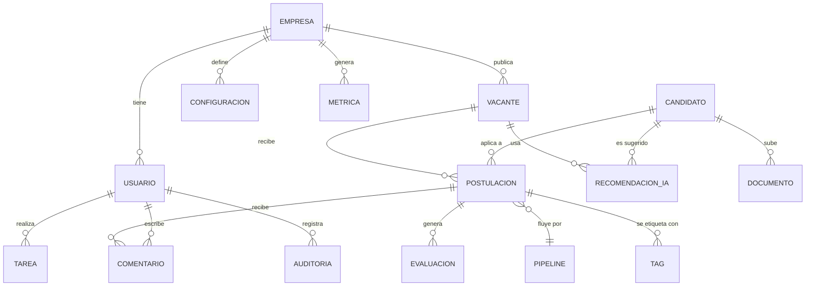

Diagrama  Entidad - Relación

```plantuml
@startuml
title Modelo de Datos – LTI ATS (con entidades auxiliares)

' ===== Estilo
hide circle
skinparam linetype ortho
skinparam backgroundColor #FAFAFA
skinparam classAttributeIconSize 0
skinparam class {
  BackgroundColor White
  ArrowColor Black
  BorderColor #666666
}

' ===== Entidades núcleo
class Usuario {
  +usuario_id: UUID
  +empresa_id: FK Empresa
  +nombre: VARCHAR(100)
  +email: VARCHAR(150)
  +rol: ENUM(reclutador, manager, candidato, admin)
  +password_hash: TEXT
  +activo: BOOLEAN
  +fecha_creacion: DATETIME
}

class Empresa {
  +empresa_id: UUID
  +nombre: VARCHAR(150)
  +industria: VARCHAR(100)
  +plan_suscripcion: ENUM(Básico, Profesional, Enterprise)
  +pais: VARCHAR(80)
  +fecha_alta: DATETIME
}

class Vacante {
  +vacante_id: UUID
  +empresa_id: FK Empresa
  +creada_por: FK Usuario
  +titulo: VARCHAR(150)
  +descripcion: TEXT
  +ubicacion: VARCHAR(100)
  +modalidad: ENUM(presencial, híbrido, remoto)
  +salario_min: DECIMAL(10,2)
  +salario_max: DECIMAL(10,2)
  +estado: ENUM(borrador, abierta, cerrada, pausada)
  +fecha_publicacion: DATETIME
}

class Candidato {
  +candidato_id: UUID
  +empresa_id: FK Empresa
  +nombre: VARCHAR(120)
  +email: VARCHAR(150)
  +telefono: VARCHAR(30)
  +consentimiento_datos: BOOLEAN
  +fecha_alta: DATETIME
}

class Postulacion {
  +postulacion_id: UUID
  +vacante_id: FK Vacante
  +candidato_id: FK Candidato
  +fecha_postulacion: DATETIME
  +etapa_actual_id: FK Etapa
  +estado: ENUM(activa, rechazada, contratada, retirada)
}

class Etapa {
  +etapa_id: UUID
  +pipeline_id: FK Pipeline
  +nombre: VARCHAR(60)  ' p.ej. Aplicación, Revisión, Entrevista, Oferta, Contratado
  +orden: INT
}

class Pipeline {
  +pipeline_id: UUID
  +vacante_id: FK Vacante
  +nombre: VARCHAR(80)
  +creado_en: DATETIME
}

class Comentario {
  +comentario_id: UUID
  +postulacion_id: FK Postulacion
  +autor_id: FK Usuario
  +texto: TEXT
  +creado_en: DATETIME
}

class Evaluacion {
  +evaluacion_id: UUID
  +postulacion_id: FK Postulacion
  +evaluador_id: FK Usuario
  +tipo: ENUM(entrevista, prueba_técnica)
  +resultado: DECIMAL(5,2)
  +comentarios: TEXT
  +fecha: DATETIME
}

class Tarea {
  +tarea_id: UUID
  +postulacion_id: FK Postulacion
  +asignado_a: FK Usuario
  +descripcion: TEXT
  +estado: ENUM(pendiente, en_progreso, completada)
  +fecha_vencimiento: DATETIME
}

class Tag {
  +tag_id: UUID
  +nombre: VARCHAR(50)
  +tipo: ENUM(habilidad, estado, prioridad)
  +color: VARCHAR(10)
}

class PostulacionTag {
  +postulacion_id: FK Postulacion
  +tag_id: FK Tag
}

class Documento {
  +documento_id: UUID
  +candidato_id: FK Candidato
  +tipo: ENUM(CV, Carta, Portafolio, Otro)
  +url: TEXT  ' S3 pre-signed
  +subido_en: DATETIME
}

class Auditoria {
  +log_id: UUID
  +usuario_id: FK Usuario
  +accion: VARCHAR(150)
  +entidad: VARCHAR(100)
  +entidad_id: UUID
  +timestamp: DATETIME
  +detalle: TEXT
}

' ===== IA / Recomendaciones (explicable)
class RecomendacionIA {
  +reco_id: UUID
  +vacante_id: FK Vacante
  +candidato_id: FK Candidato
  +score: DECIMAL(5,2)
  +razones_json: JSON  ' factores de afinidad explicables
  +modelo_version: VARCHAR(50)
  +generada_en: DATETIME
}

class DecisionIA {
  +decision_id: UUID
  +reco_id: FK RecomendacionIA
  +usuario_id: FK Usuario
  +accion: ENUM(aceptada, descartada)
  +motivo: TEXT
  +timestamp: DATETIME
}

' ===== Automatización (motor de reglas)
class Regla {
  +regla_id: UUID
  +empresa_id: FK Empresa
  +nombre: VARCHAR(120)
  +descripcion: TEXT
  +trigger: ENUM(cambio_etapa, nueva_postulacion, nueva_vacante, tiempo_inactivo)
  +condicion_json: JSON   ' filtros/condiciones
  +accion: ENUM(notificar, asignar_tarea, cambiar_etapa, etiquetar)
  +parametros_json: JSON  ' parámetros de la acción
  +activo: BOOLEAN
  +creada_por: FK Usuario
  +creada_en: DATETIME
}

class EjecucionRegla {
  +exec_id: UUID
  +regla_id: FK Regla
  +entidad: VARCHAR(60)   ' Postulacion, Vacante, Candidato...
  +entidad_id: UUID
  +resultado: ENUM(exito, fallo)
  +detalle: TEXT
  +ejecutada_en: DATETIME
}

class Plantilla {
  +plantilla_id: UUID
  +empresa_id: FK Empresa
  +nombre: VARCHAR(120)
  +canal: ENUM(email, sms, inapp)
  +asunto: VARCHAR(150)
  +cuerpo: TEXT   ' puede incluir variables {{...}}
  +creada_por: FK Usuario
  +creada_en: DATETIME
}

class Notificacion {
  +notificacion_id: UUID
  +destino_tipo: ENUM(usuario, candidato)
  +destino_id: UUID
  +canal: ENUM(email, sms, inapp)
  +plantilla_id: FK Plantilla
  +payload_json: JSON
  +estado: ENUM(pendiente, enviado, fallido)
  +enviado_en: DATETIME
}

' ===== Integraciones
class Integracion {
  +integracion_id: UUID
  +empresa_id: FK Empresa
  +tipo: ENUM(job_board, firma, calendario, video, correo, datos)
  +proveedor: VARCHAR(80)  ' LinkedIn, Indeed, DocuSign, Google, Zoom...
  +config_json: JSON       ' scopes, endpoints
  +estado: ENUM(activa, inactiva)
  +creada_en: DATETIME
}

class TokenIntegracion {
  +token_id: UUID
  +integracion_id: FK Integracion
  +access_token: TEXT
  +refresh_token: TEXT
  +expires_at: DATETIME
}

' ===== Analítica y reportes
class Metrica {
  +metrica_id: UUID
  +empresa_id: FK Empresa
  +vacante_id: FK Vacante
  +usuario_id: FK Usuario
  +nombre: VARCHAR(120)    ' p.ej. time_to_hire, conversion_rate
  +valor_num: DECIMAL(12,4)
  +valor_json: JSON
  +fecha: DATETIME
}

class Dashboard {
  +dashboard_id: UUID
  +empresa_id: FK Empresa
  +nombre: VARCHAR(120)
  +filtros_json: JSON
  +creado_por: FK Usuario
  +creado_en: DATETIME
}

class DashboardMetrica {
  +dashboard_id: FK Dashboard
  +metrica_id: FK Metrica
}

class Reporte {
  +reporte_id: UUID
  +dashboard_id: FK Dashboard
  +formato: ENUM(csv, pdf)
  +url: TEXT
  +generado_en: DATETIME
}

class Alerta {
  +alerta_id: UUID
  +empresa_id: FK Empresa
  +metrica_nombre: VARCHAR(120)
  +condicion: ENUM(>, >=, <, <=, =, !=)
  +umbral: DECIMAL(12,4)
  +notificar_a: FK Usuario
  +activo: BOOLEAN
  +creada_en: DATETIME
}

' ===== Configuración general
class Configuracion {
  +config_id: UUID
  +empresa_id: FK Empresa
  +clave: VARCHAR(120)
  +valor: TEXT
  +tipo: ENUM(boolean, number, string, json)
  +actualizada_en: DATETIME
}

' ===== Relaciones (resumen)
Empresa "1" -- "many" Usuario : tiene >
Empresa "1" -- "many" Vacante : publica >
Empresa "1" -- "many" Configuracion : define >
Empresa "1" -- "many" Metrica : genera >
Empresa "1" -- "many" Dashboard : visualiza >
Empresa "1" -- "many" Integracion : conecta >
Empresa "1" -- "many" Regla : orquesta >
Empresa "1" -- "many" Plantilla : comunica >
Empresa "1" -- "many" Candidato : gestiona >

Vacante "1" -- "many" Postulacion : recibe >
Vacante "1" -- "one"  Pipeline : define >
Pipeline "1" -- "many" Etapa : contiene >
Etapa "1" -- "many" Postulacion : etapa_actual >

Candidato "1" -- "many" Postulacion : aplica >
Candidato "1" -- "many" Documento : sube >
Candidato "1" -- "many" Notificacion : recibe >

Postulacion "1" -- "many" Comentario : anota >
Postulacion "1" -- "many" Evaluacion : evalua >
Postulacion "1" -- "many" Tarea : genera >
Postulacion "many" -- "many" Tag : etiqueta
Postulacion "1" -- "many" RecomendacionIA : usa <

Usuario "1" -- "many" Comentario : escribe >
Usuario "1" -- "many" Evaluacion : aplica >
Usuario "1" -- "many" Tarea : realiza >
Usuario "1" -- "many" Auditoria : registra >
Usuario "1" -- "many" DecisionIA : decide >
Usuario "1" -- "many" Dashboard : crea >
Usuario "1" -- "many" Alerta : recibe >

RecomendacionIA "1" -- "many" DecisionIA : decisiones >

Regla "1" -- "many" EjecucionRegla : ejecuta >
Regla "1" -- "many" Notificacion : dispara >
Plantilla "1" -- "many" Notificacion : usa >
Integracion "1" -- "many" TokenIntegracion : tokens >
Dashboard "many" -- "many" Metrica : incluye > DashboardMetrica

@enduml
```

### Principios del Diseño

1. **Escalabilidad:** cada empresa tiene su propio dominio de datos.  
2. **IA explicable:** la entidad `Recomendación_IA` almacena factores de afinidad en JSON.  
3. **Trazabilidad total:** `Auditoría` + `Historial` permiten reconstruir cualquier evento.  
4. **Automatización extensible:** `Regla` + `Plantilla` + `Notificación` forman el motor de workflow.  
5. **Integración modular:** APIs externas se gestionan por entidad `Integración`.  


---


# Arquitectura de Alto Nivel — LTI ATS 

Esta arquitectura implementa **microservicios** en **AWS** con **propiedad de datos por servicio**, **event-driven**, **API Gateway**, **CDN**, **autenticación centralizada**, **observabilidad completa**, **cache** y **búsqueda**. Está alineada con la imagen previa y agrega elementos que faltaban (autenticación explícita, data lake/analítica extendida y detalles de observabilidad).


### 1) Componentes principales

- **Frontend Web (React)**: SPA servida desde **S3** y distribuida por **CloudFront**. Maneja autenticación con **AWS Cognito (User Pools)** y envía **JWT** en cada request.
- **Perímetro/Edge**: **CloudFront + WAF** (protección L7, rate-limits básicos) → **API Gateway (HTTP API)** con **JWT Authorizer** (Cognito).
- **Balanceo**: **Private ALB** dentro de **VPC** para enrutar tráfico a **ECS Fargate** (microservicios).
- **Microservicios** (uno por dominio): Vacantes, Candidatos, Postulaciones, IA/Scoring, Notificaciones, Búsqueda/Index, Analítica API, Integraciones, Tareas/Automatización. **Cada uno con su BD**.
- **Bases de datos**:
  - **Aurora PostgreSQL** para dominios transaccionales (Vacantes, Candidatos, Postulaciones, Notificaciones, Tareas).
  - **DynamoDB** para **IA/Scoring** (feature store/perfiles).
  - **OpenSearch** para **búsqueda** full‑text (index de candidatos y vacantes).
  - **S3** para documentos (CVs/portafolios) con **pre‑signed URLs**.
  - **Redshift Serverless / Athena+S3** para **analítica** y BI.
- **Mensajería/Eventos**: **SNS** (tópicos) + **SQS** (colas por consumidor) y/o **EventBridge**. Publicación desde servicios (outbox) y consumo idempotente.
- **Cache**: **ElastiCache/Redis** para lecturas calientes, sesiones efímeras, locks.
- **Observabilidad**: **CloudWatch Logs/Metrics**, **AWS X‑Ray** (tracing / OTel), **Amazon Managed Prometheus/Grafana** para dashboards.
- **Integraciones externas**: **SES/Pinpoint** (email/SMS), **DocuSign/HelloSign** (firma), **LinkedIn/Indeed** (job boards), **Google/Microsoft** (calendario), **Zoom/Teams** (entrevistas).
- **Seguridad**: **WAF**, **Cognito**, **Secrets Manager**, **KMS** (datos en reposo), **TLS** (en tránsito), **SG/NACL** en VPC, **Shield Advanced** opcional.


### 2) Diagrama de arquitectura (PlantUML)

> Puedes renderizar este diagrama con PlantUML. Guarda el bloque en `arquitectura_lti_ats.puml` y ejecútalo con `plantuml arquitectura_lti_ats.puml`.


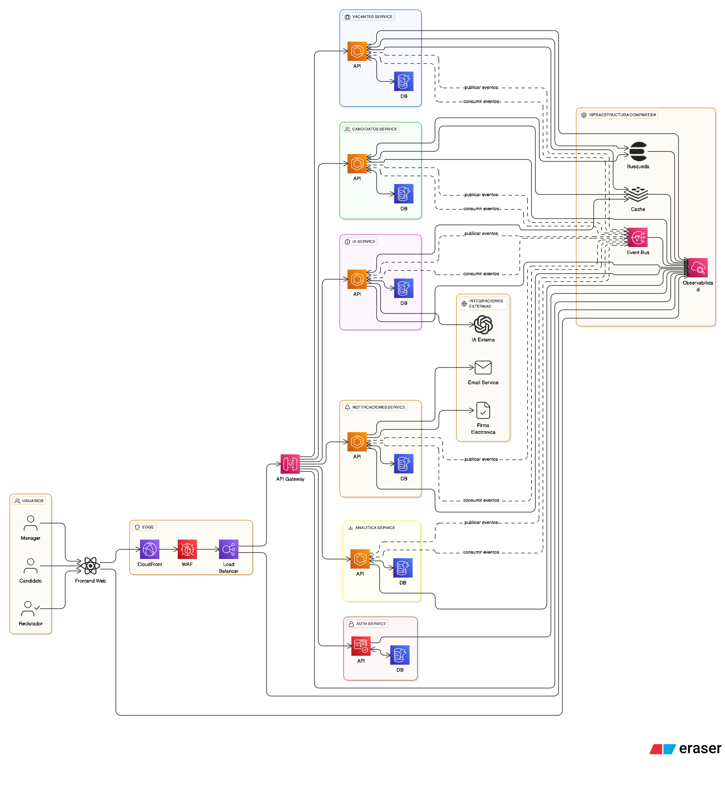


```plantuml
@startuml
title Arquitectura de Alto Nivel — LTI ATS (AWS, Microservicios)

skinparam backgroundColor #FAFAFA
skinparam componentStyle rectangle
skinparam shadowing false
skinparam linetype ortho
hide circle

' ==== Edge / Frontend ====
package "Edge & Frontend" #fffbe6 {
  [CloudFront CDN] as CF
  [AWS WAF] as WAF
  [S3 (Static Web)] as S3WEB
  [Frontend Web (React SPA)] as FE
  CF -down- WAF
  S3WEB -down- FE
}

' ==== Auth ====
package "AuthN/AuthZ" #e6f7ff {
  [AWS Cognito (User Pools)] as COG
}

' ==== API Layer ====
package "API Edge" #f0f5ff {
  [Amazon API Gateway (HTTP API)] as APIGW
  [Private ALB] as ALB
  APIGW -right-> ALB
}

' ==== Infra compartida ====
package "Infraestructura Compartida" #fff0f6 {
  [ElastiCache / Redis] as REDIS
  [Amazon OpenSearch] as OS
  [Event Bus (SNS/EventBridge)] as BUS
  [S3 (Documentos CVs)] as S3DOCS
}

' ==== Observabilidad ====
package "Observabilidad" #f6ffed {
  [CloudWatch Logs/Metrics] as CW
  [AWS X-Ray (Tracing)] as XRAY
  [Managed Prometheus/Grafana] as AMP
}

' ==== Data & Analytics ====
package "Data & Analytics" #e8f5e9 {
  [Aurora PostgreSQL] as AURORA note right
    Representa múltiples clústeres Aurora,
    uno por servicio transaccional
  end note
  [DynamoDB (Feature Store IA)] as DDB
  [S3 Data Lake] as S3DL
  [Athena/Glue] as ATHENA
  [Redshift Serverless] as REDSHIFT
}

' ==== Integraciones ====
package "Integraciones Externas" #fff2e8 {
  [SES/Pinpoint (Email/SMS)] as SES
  [DocuSign/HelloSign] as SIGN
  [Job Boards (LinkedIn/Indeed)] as JOBS
  [Calendarios (Google/MS)] as CAL
  [Videollamadas (Zoom/Teams)] as VIDEO
}

' ==== Microservicios (ECS Fargate) ====
package "VPC Privada (ECS Fargate)" #eef7ff {
  [Svc Vacantes] as SVC_VAC
  [DB Vacantes (Aurora)] as DB_VAC

  [Svc Candidatos] as SVC_CAN
  [DB Candidatos (Aurora)] as DB_CAN

  [Svc Postulaciones] as SVC_POS
  [DB Postulaciones (Aurora)] as DB_POS

  [Svc IA / Scoring] as SVC_IA
  [DB IA (DynamoDB)] as DB_IA

  [Svc Notificaciones] as SVC_NOT
  [DB Notif (Aurora)] as DB_NOT

  [Svc Búsqueda / Index] as SVC_IDX
  [DB IndexMeta (Aurora)] as DB_IDX

  [Svc Analítica / Reports API] as SVC_AN
  [Svc Integraciones] as SVC_INT
  [Svc Tareas / Automatización] as SVC_TAR
  [DB Tareas (Aurora)] as DB_TAR

  ' Colocaciones básicas
  SVC_VAC -down- DB_VAC
  SVC_CAN -down- DB_CAN
  SVC_POS -down- DB_POS
  SVC_IA -down- DB_IA
  SVC_NOT -down- DB_NOT
  SVC_IDX -down- DB_IDX
  SVC_TAR -down- DB_TAR
}

' ==== Flujos de Frontend/Edge ====
FE -down-> CF : Static assets
CF -down-> APIGW : HTTPS + JWT
APIGW -right-> COG : JWT Authorizer

' ==== API ⇄ Servicios ====
APIGW -down-> ALB
ALB -down-> SVC_VAC
ALB -down-> SVC_CAN
ALB -down-> SVC_POS
ALB -down-> SVC_IA
ALB -down-> SVC_NOT
ALB -down-> SVC_IDX
ALB -down-> SVC_AN
ALB -down-> SVC_INT
ALB -down-> SVC_TAR

' ==== Servicios → Infra compartida ====
SVC_VAC -right-> REDIS
SVC_CAN -right-> REDIS
SVC_POS -right-> REDIS

SVC_VAC -right-> BUS : publicar eventos
SVC_CAN -right-> BUS : publicar eventos
SVC_POS -right-> BUS : publicar eventos

BUS -down-> SVC_IDX : consumir (reindexado)
BUS -down-> SVC_NOT : consumir (triggers)
BUS -down-> SVC_IA  : consumir (features)

SVC_IDX -right-> OS : indexar/buscar
SVC_CAN -right-> S3DOCS : pre-signed URLs (CVs)

' ==== BDs por servicio ====
SVC_VAC -down-> DB_VAC
SVC_CAN -down-> DB_CAN
SVC_POS -down-> DB_POS
SVC_IA -down-> DB_IA
SVC_NOT -down-> DB_NOT
SVC_IDX -down-> DB_IDX
SVC_TAR -down-> DB_TAR

' ==== Analítica / Data Lake ====
BUS -right-> S3DL : eventos a data lake
S3DL -down-> ATHENA
ATHENA -down-> REDSHIFT
SVC_AN -left-> REDSHIFT : KPIs/BI

' ==== Observabilidad ====
SVC_VAC -right-> CW
SVC_CAN -right-> CW
SVC_POS -right-> CW
SVC_IA  -right-> CW
SVC_NOT -right-> CW
SVC_IDX -right-> CW
SVC_AN  -right-> CW
SVC_INT -right-> CW
SVC_TAR -right-> CW
APIGW -right-> CW
ALB -right-> CW
CW -down-> AMP
SVC_VAC -right-> XRAY
SVC_IA -right-> XRAY
APIGW -right-> XRAY

' ==== Integraciones externas ====
SVC_NOT -right-> SES
SVC_INT -right-> SIGN
SVC_VAC -right-> JOBS
SVC_POS -right-> CAL
SVC_POS -right-> VIDEO

@enduml
```


### 3) Microservicios y bases de datos

| Servicio | Responsabilidad principal | Base de datos (owned) | Integraciones |
|---|---|---|---|
| **Vacantes** | CRUD vacantes, publicación a job boards, pipeline base | **Aurora Postgres** | Event Bus, Búsqueda, Job Boards |
| **Candidatos** | CRUD candidatos, documentos, perfiles | **Aurora Postgres** | S3 (CVs), Búsqueda, Event Bus |
| **Postulaciones** | Aplicación a vacantes, movimiento de etapas, comentarios | **Aurora Postgres** | Event Bus, Calendarios, Video |
| **IA/Scoring** | Feature store, matching, explicabilidad | **DynamoDB** | OpenSearch, Event Bus |
| **Búsqueda/Index** | Índices full‑text (vacantes/candidatos) | **OpenSearch** (+ Aurora metadatos) | Consume eventos |
| **Notificaciones** | Plantillas, outbox, envíos (email/SMS/push) | **Aurora Postgres** | SES/Pinpoint, Event Bus |
| **Analítica/Reports API** | KPIs y consultas agregadas | **Redshift/Athena** | Data Lake (S3), Event Bus |
| **Integraciones** | Conectores (firma, calendarios, video) | **Aurora Postgres** | DocuSign, Google/MS, Zoom/Teams |
| **Tareas/Automatización** | Reglas trigger/condición/acción, tareas asignadas | **Aurora Postgres** | Event Bus, Redis |


### 4) Garantías de la arquitectura

- **Escalable**: autoscaling por servicio (ECS Fargate), caché con Redis, búsqueda con OpenSearch y colas SNS/SQS para picos.  
- **Resiliente**: Multi‑AZ en datos, retrys y DLQ, outbox + idempotencia, circuit breakers y despliegues blue/green.  
- **Segura**: WAF, Cognito + JWT, KMS, TLS, SG/NACL, Secrets Manager, pre‑signed URLs para S3.  
- **Mantenible**: dominios bien delimitados, bases por servicio, contratos API versionados, IaC, observabilidad centralizada.


---

## Diagramas C4

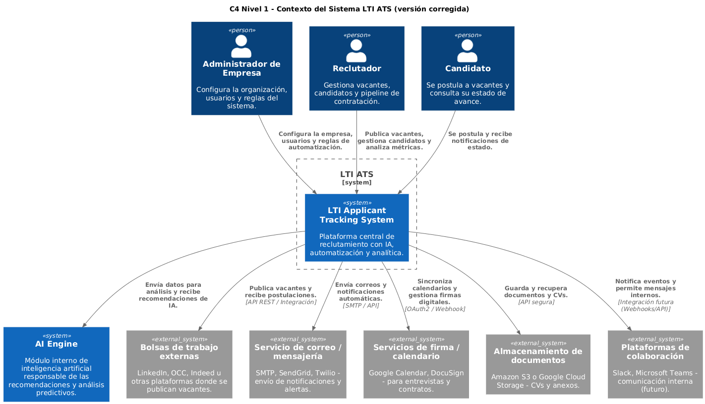

## Nivel 1 — Contexto del Sistema

```plantuml
@startuml
!include https://raw.githubusercontent.com/plantuml-stdlib/C4-PlantUML/master/C4_Context.puml

title C4 Nivel 1 – Contexto del Sistema LTI ATS (versión corregida)

' === Personas (actores humanos) ===
Person(admin, "Administrador de Empresa", "Configura la organización, usuarios y reglas del sistema.")
Person(recruiter, "Reclutador", "Gestiona vacantes, candidatos y pipeline de contratación.")
Person(candidate, "Candidato", "Se postula a vacantes y consulta su estado de avance.")

' === Sistema principal ===
System_Boundary(lti, "LTI ATS") {
  System(lti_system, "LTI Applicant Tracking System", "Plataforma central de reclutamiento con IA, automatización y analítica.")
}

' === Sistemas externos ===
System(ia_engine, "AI Engine", "Módulo interno de inteligencia artificial responsable de las recomendaciones y análisis predictivos.")
System_Ext(jobboards, "Bolsas de trabajo externas", "LinkedIn, OCC, Indeed u otras plataformas donde se publican vacantes.")
System_Ext(mail_service, "Servicio de correo / mensajería", "SMTP, SendGrid, Twilio – envío de notificaciones y alertas.")
System_Ext(signing, "Servicios de firma / calendario", "Google Calendar, DocuSign – para entrevistas y contratos.")
System_Ext(storage, "Almacenamiento de documentos", "Amazon S3 o Google Cloud Storage – CVs y anexos.")
System_Ext(collab, "Plataformas de colaboración", "Slack, Microsoft Teams – comunicación interna (futuro).")

' === Relaciones entre actores y sistema ===
Rel(admin, lti_system, "Configura la empresa, usuarios y reglas de automatización.")
Rel(recruiter, lti_system, "Publica vacantes, gestiona candidatos y analiza métricas.")
Rel(candidate, lti_system, "Se postula y recibe notificaciones de estado.")

' === Relaciones con sistemas externos ===
Rel(lti_system, ia_engine, "Envía datos para análisis y recibe recomendaciones de IA.")
Rel(lti_system, jobboards, "Publica vacantes y recibe postulaciones.", "API REST / Integración")
Rel(lti_system, mail_service, "Envía correos y notificaciones automáticas.", "SMTP / API")
Rel(lti_system, signing, "Sincroniza calendarios y gestiona firmas digitales.", "OAuth2 / Webhook")
Rel(lti_system, storage, "Guarda y recupera documentos y CVs.", "API segura")
Rel(lti_system, collab, "Notifica eventos y permite mensajes internos.", "Integración futura (Webhooks/API)")

@enduml

```


---

## Nivel 2 — Contenedores (Core de Reclutamiento)


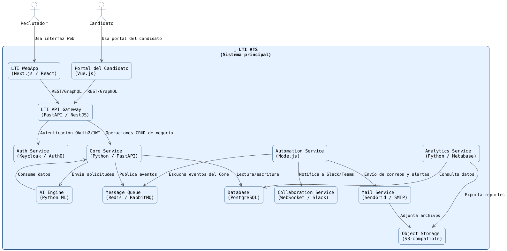


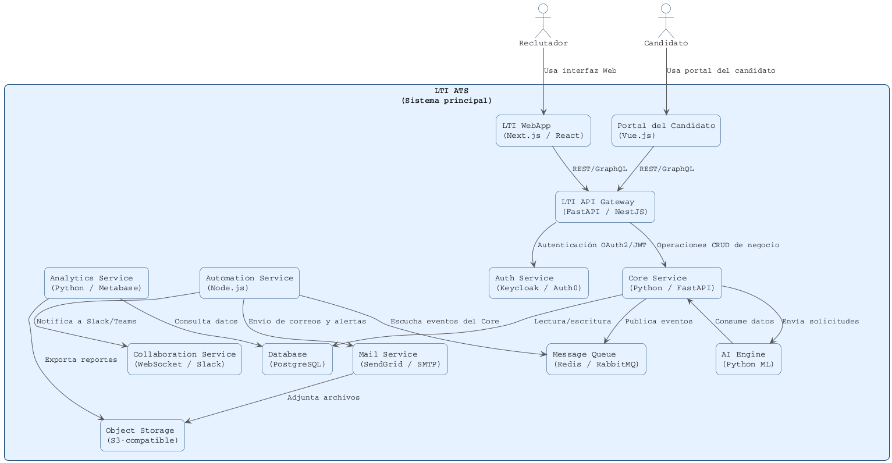


## Nivel 3 — Componentes del Core de Reclutamiento (Vacantes-Candidatos.PipeLine)

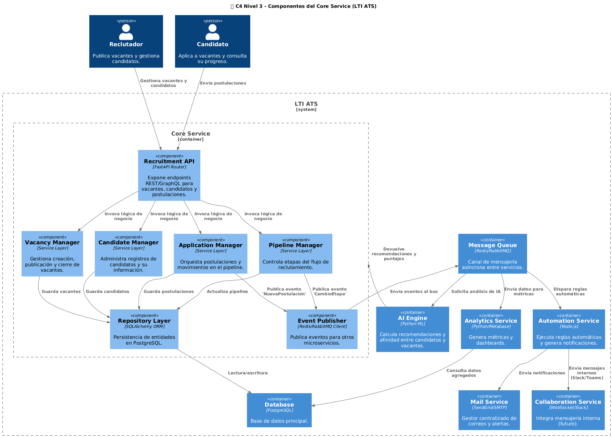


```plantuml
@startuml
!include https://raw.githubusercontent.com/plantuml-stdlib/C4-PlantUML/master/C4_Component.puml

title 🧩 C4 Nivel 3 – Componentes del Core Service (LTI ATS)

Person(recruiter, "Reclutador", "Publica vacantes y gestiona candidatos.")
Person(candidate, "Candidato", "Aplica a vacantes y consulta su progreso.")

System_Boundary(lti, "LTI ATS") {

  Container_Boundary(core, "Core Service") {
    Component(api, "Recruitment API", "FastAPI Router", "Expone endpoints REST/GraphQL para vacantes, candidatos y postulaciones.")
    Component(svc_vac, "Vacancy Manager", "Service Layer", "Gestiona creación, publicación y cierre de vacantes.")
    Component(svc_cand, "Candidate Manager", "Service Layer", "Administra registros de candidatos y su información.")
    Component(svc_app, "Application Manager", "Service Layer", "Orquesta postulaciones y movimientos en el pipeline.")
    Component(svc_pipe, "Pipeline Manager", "Service Layer", "Controla etapas del flujo de reclutamiento.")
    Component(repo, "Repository Layer", "SQLAlchemy ORM", "Persistencia de entidades en PostgreSQL.")
    Component(pub, "Event Publisher", "Redis/RabbitMQ Client", "Publica eventos para otros microservicios.")
  }

  Container(automation, "Automation Service", "Node.js", "Ejecuta reglas automáticas y genera notificaciones.")
  Container(ai, "AI Engine", "Python ML", "Calcula recomendaciones y afinidad entre candidatos y vacantes.")
  Container(mail, "Mail Service", "SendGrid/SMTP", "Gestor centralizado de correos y alertas.")
  Container(collab, "Collaboration Service", "WebSocket/Slack", "Integra mensajería interna (futuro).")
  Container(analytics, "Analytics Service", "Python/Metabase", "Genera métricas y dashboards.")
  Container(db, "Database", "PostgreSQL", "Base de datos principal.")
  Container(queue, "Message Queue", "Redis/RabbitMQ", "Canal de mensajería asíncrona entre servicios.")
}

Rel(recruiter, api, "Gestiona vacantes y candidatos")
Rel(candidate, api, "Envía postulaciones")

Rel(api, svc_vac, "Invoca lógica de negocio")
Rel(api, svc_cand, "Invoca lógica de negocio")
Rel(api, svc_app, "Invoca lógica de negocio")
Rel(api, svc_pipe, "Invoca lógica de negocio")

Rel(svc_app, repo, "Guarda postulaciones")
Rel(svc_vac, repo, "Guarda vacantes")
Rel(svc_cand, repo, "Guarda candidatos")
Rel(svc_pipe, repo, "Actualiza pipeline")
Rel(repo, db, "Lectura/escritura")

Rel(svc_app, pub, "Publica evento 'NuevaPostulación'")
Rel(svc_pipe, pub, "Publica evento 'CambioEtapa'")
Rel(pub, queue, "Envía eventos al bus")

Rel(queue, automation, "Dispara reglas automáticas")
Rel(queue, ai, "Solicita análisis de IA")
Rel(queue, analytics, "Envía datos para métricas")

Rel(automation, mail, "Envía notificaciones")
Rel(automation, collab, "Envía mensajes internos (Slack/Teams)")
Rel(ai, core, "Devuelve recomendaciones y puntajes")
Rel(analytics, db, "Consulta datos agregados")

@enduml

```


## Nivel 4 — Código (Ejemplo: Postulaciones/Pipeline)

Incluye: estructura de carpetas, modelo de datos, API, contratos de eventos, código TypeScript, reglas del workflow, publicación SNS, pruebas y diagramas de secuencia.


Este documento baja al **Nivel 4 (Código)** del microservicio **Postulaciones/Pipeline** en su **versión hexagonal**.  
Proporciona estructura, contratos, ejemplos de código, migraciones, pruebas, observabilidad, seguridad y checklist de entrega.

> **Stack de referencia:** TypeScript + NestJS + Sequelize (Aurora PostgreSQL) + AWS SNS/SQS + Redis + Cognito JWT.

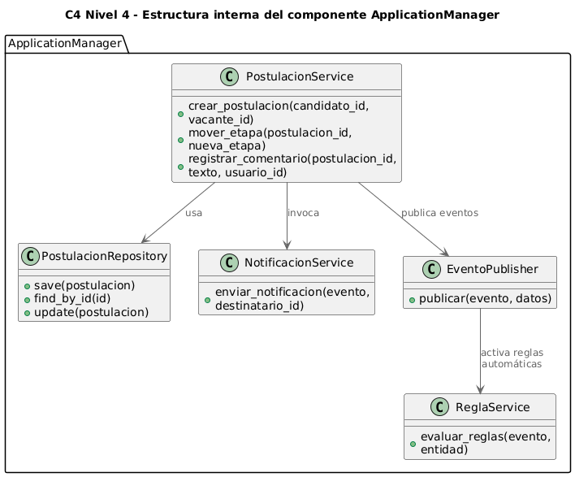

```plantuml
@startuml
!include https://raw.githubusercontent.com/plantuml-stdlib/C4-PlantUML/master/C4_Dynamic.puml
title C4 Nivel 4 – Estructura interna del componente ApplicationManager

package "ApplicationManager" {
  class PostulacionService {
    +crear_postulacion(candidato_id, vacante_id)
    +mover_etapa(postulacion_id, nueva_etapa)
    +registrar_comentario(postulacion_id, texto, usuario_id)
  }

  class PostulacionRepository {
    +save(postulacion)
    +find_by_id(id)
    +update(postulacion)
  }

  class NotificacionService {
    +enviar_notificacion(evento, destinatario_id)
  }

  class EventoPublisher {
    +publicar(evento, datos)
  }

  class ReglaService {
    +evaluar_reglas(evento, entidad)
  }
}

PostulacionService --> PostulacionRepository : usa
PostulacionService --> NotificacionService : invoca
PostulacionService --> EventoPublisher : publica eventos
EventoPublisher --> ReglaService : activa reglas automáticas
@enduml

```


#### C4 Nivel 4 – Vista Dinámica (Flujo de Postulación y Pipeline),
que complementa tu modelo C4 a nivel de comportamiento (secuencia temporal de interacción).

Este diagrama muestra cómo un Reclutador crea una postulación, cómo el ApplicationManager orquesta las acciones internas, y cómo intervienen los servicios de Automatización, Notificación, y IA después del evento.


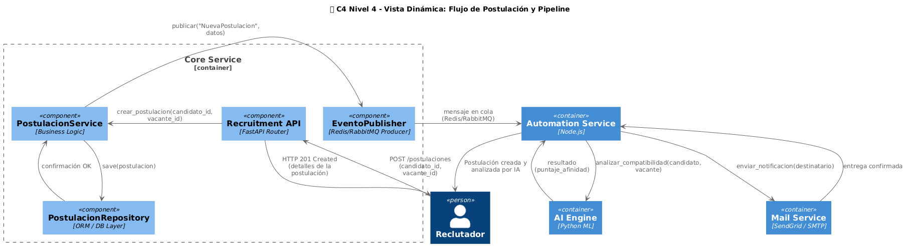


```plantuml
@startuml
!include https://raw.githubusercontent.com/plantuml-stdlib/C4-PlantUML/master/C4_Dynamic.puml

title 🧩 C4 Nivel 4 – Vista Dinámica: Flujo de Postulación y Pipeline

' ==== Participantes principales ====
Person(recruiter, "Reclutador")
Container_Boundary(core, "Core Service") {
  Component(api, "Recruitment API", "FastAPI Router")
  Component(app_service, "PostulacionService", "Business Logic")
  Component(repo, "PostulacionRepository", "ORM / DB Layer")
  Component(pub, "EventoPublisher", "Redis/RabbitMQ Producer")
}
Container(automation, "Automation Service", "Node.js")
Container(mail, "Mail Service", "SendGrid / SMTP")
Container(ai, "AI Engine", "Python ML")

' ==== Flujo de eventos ====

' Paso 1: Reclutador crea una nueva postulación
recruiter -> api : POST /postulaciones (candidato_id, vacante_id)
api -> app_service : crear_postulacion(candidato_id, vacante_id)

' Paso 2: El servicio guarda la postulación
app_service -> repo : save(postulacion)
repo --> app_service : confirmación OK

' Paso 3: Se genera evento y notificación
app_service -> pub : publicar("NuevaPostulacion", datos)
pub -> automation : mensaje en cola (Redis/RabbitMQ)

' Paso 4: Automatización activa notificaciones
automation -> mail : enviar_notificacion(destinatario)
mail --> automation : entrega confirmada

' Paso 5: Automatización dispara reglas de IA
automation -> ai : analizar_compatibilidad(candidato, vacante)
ai --> automation : resultado (puntaje_afinidad)

' Paso 6: Registro y respuesta
automation --> recruiter : "Postulación creada y analizada por IA"
api --> recruiter : HTTP 201 Created (detalles de la postulación)

@enduml

```

### 🗂️ Estructura de carpetas
```
src/
└─ pipeline/
   ├─ application/
   │   ├─ controllers/
   │   │   └─ pipeline.controller.ts
   │   ├─ use-cases/
   │   │   ├─ create-application.handler.ts
   │   │   └─ advance-stage.handler.ts
   │   └─ event-consumers/
   │       └─ application-events.consumer.ts
   ├─ domain/
   │   ├─ entities/
   │   │   ├─ application.entity.ts
   │   │   └─ stage.entity.ts
   │   ├─ services/
   │   │   ├─ pipeline.service.ts
   │   │   └─ workflow.engine.ts
   │   ├─ ports/
   │   │   ├─ application-repository.port.ts
   │   │   ├─ event-publisher.port.ts
   │   │   └─ external-adapters.port.ts
   └─ infrastructure/
       ├─ repositories/
       │   └─ sequelize-application.repository.ts
       ├─ publishers/
       │   └─ sns-event.publisher.ts
       ├─ adapters/
       │   ├─ scoring.adapter.ts
       │   ├─ notifications.adapter.ts
       │   └─ interviews.adapter.ts
       └─ orm/
           └─ application.model.ts
```

---

#### Dominio (entidades y servicios)

```ts
// domain/entities/application.entity.ts
export type ApplicationStatus = 'CREATED'|'IN_PROGRESS'|'HIRED'|'REJECTED';
export type StageKey =
  'APPLIED'|'SCREENING'|'HR_INTERVIEW'|'TECH_INTERVIEW'|'MANAGER_INTERVIEW'|'OFFER'|'HIRED'|'REJECTED';

export class Application {
  constructor(
    public readonly id: string,
    public candidateId: string,
    public vacancyId: string,
    public currentStage: StageKey = 'APPLIED',
    public status: ApplicationStatus = 'CREATED'
  ) {}
  advance(to: StageKey) {
    this.currentStage = to;
    this.status = to === 'HIRED' ? 'HIRED' :
                  to === 'REJECTED' ? 'REJECTED' : 'IN_PROGRESS';
  }
}
```

### Servicio de dominio
```ts
export class PipelineService {
  constructor(
    private readonly repo: ApplicationRepositoryPort,
    private readonly publisher: EventPublisherPort,
    private readonly workflow: WorkflowEngine
  ) {}

  async create(app: Application, traceId?: string) {
    await this.repo.save(app);
    await this.publisher.publish('ats.pipeline.application.created', {
      eventType: 'application.created',
      occurredAt: new Date().toISOString(),
      traceId,
      application: app
    });
    return app;
  }

  async advanceStage(id: string, targetStage: string) {
    const app = await this.repo.findById(id);
    if (!app) throw new Error('APPLICATION_NOT_FOUND');
    this.workflow.assertTransition(app.currentStage, targetStage);
    app.advance(targetStage as any);
    await this.repo.save(app);
    await this.publisher.publish('ats.pipeline.stage.updated', {
      eventType: 'stage.updated',
      occurredAt: new Date().toISOString(),
      application: app
    });
    return app;
  }
}
```

### Reglas de transición
```ts
const transitions = {
  APPLIED: ['SCREENING'],
  SCREENING: ['HR_INTERVIEW','REJECTED'],
  HR_INTERVIEW: ['TECH_INTERVIEW','REJECTED'],
  TECH_INTERVIEW: ['MANAGER_INTERVIEW','REJECTED'],
  MANAGER_INTERVIEW: ['OFFER','REJECTED'],
  OFFER: ['HIRED','REJECTED'],
  HIRED: [],
  REJECTED: []
};

export class WorkflowEngine {
  assertTransition(from: string, to: string) {
    if (!(transitions[from] || []).includes(to))
      throw new Error(`INVALID_TRANSITION ${from}->${to}`);
  }
}
```

### Puertos (interfaces)
```ts
export interface ApplicationRepositoryPort {
  save(app: Application): Promise<void>;
  findById(id: string): Promise<Application|null>;
}
export interface EventPublisherPort {
  publish(topicKey: string, payload: object): Promise<void>;
}
```

---

## 🧰 Infraestructura

### ORM
```ts
export class ApplicationModel extends Model {}
ApplicationModel.init({
  id: { type: DataTypes.UUID, primaryKey: true },
  candidateId: DataTypes.UUID,
  vacancyId: DataTypes.UUID,
  status: DataTypes.ENUM('CREATED','IN_PROGRESS','HIRED','REJECTED'),
  currentStage: DataTypes.ENUM('APPLIED','SCREENING','HR_INTERVIEW','TECH_INTERVIEW','MANAGER_INTERVIEW','OFFER','HIRED','REJECTED')
},{ sequelize });
```

### Repositorio
```ts
export class SequelizeApplicationRepository implements ApplicationRepositoryPort {
  async save(app: Application) {
    await ApplicationModel.upsert(app);
  }
  async findById(id: string) {
    const r = await ApplicationModel.findByPk(id);
    return r ? new Application(r.id, r.candidateId, r.vacancyId, r.currentStage, r.status) : null;
  }
}
```

### Publicador SNS
```ts
export class SnsEventPublisher implements EventPublisherPort {
  constructor(private client = new SNSClient({}), private topics: Record<string,string>) {}
  async publish(topicKey: string, payload: object) {
    const TopicArn = this.topics[topicKey];
    await this.client.send(new PublishCommand({ TopicArn, Message: JSON.stringify(payload) }));
  }
}
```

---

## 📡 Extracto OpenAPI 3.0
```yaml
paths:
  /applications:
    post:
      summary: Crear una postulación
      requestBody:
        content:
          application/json:
            schema:
              properties:
                candidateId: { type: string }
                vacancyId: { type: string }
      responses:
        "201": { description: Creada }
  /applications/{id}/advance:
    post:
      summary: Avanzar etapa del pipeline
      requestBody:
        content:
          application/json:
            schema:
              properties:
                targetStage: { type: string, enum: [APPLIED,SCREENING,...] }
```

---

## 🔔 Contrato de evento (JSON Schema)
```json
{
  "$schema": "https://json-schema.org/draft/2020-12/schema",
  "title": "ApplicationCreated",
  "type": "object",
  "properties": {
    "eventType": { "const": "application.created" },
    "occurredAt": { "format": "date-time" },
    "application": {
      "type": "object",
      "properties": {
        "id": {"format": "uuid"},
        "candidateId": {"format": "uuid"},
        "vacancyId": {"format": "uuid"},
        "currentStage": {"type": "string"},
        "status": {"type": "string"}
      }
    }
  },
  "required": ["eventType","occurredAt","application"]
}
```

---

## 🧪 Pruebas unitarias y de integración
```ts
describe('WorkflowEngine', ()=>{
  it('permite APPLIED→SCREENING', ()=> expect(()=>new WorkflowEngine().assertTransition('APPLIED','SCREENING')).not.toThrow());
});
```
Integración: usar Postgres con testcontainers; validar ORM + repositorio.

---

## 🔐 Seguridad y observabilidad
- JWT (Cognito) con scopes `pipeline:read/write`.  
- Logs estructurados (JSON).  
- Métricas Prometheus: `pipeline_stage_transitions_total{stage}`.  
- Trazas AWS X-Ray / OpenTelemetry.

---

## 🧳 Migraciones SQL (Extracto)
```sql
CREATE TYPE application_status AS ENUM ('CREATED','IN_PROGRESS','HIRED','REJECTED');
CREATE TABLE applications (
  id UUID PRIMARY KEY,
  candidate_id UUID NOT NULL,
  vacancy_id UUID NOT NULL,
  status application_status DEFAULT 'CREATED',
  current_stage TEXT DEFAULT 'APPLIED',
  score INT,
  created_at TIMESTAMPTZ DEFAULT now(),
  updated_at TIMESTAMPTZ DEFAULT now()
);
```


## 🔁 Secuencia de creación

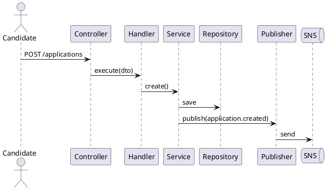

